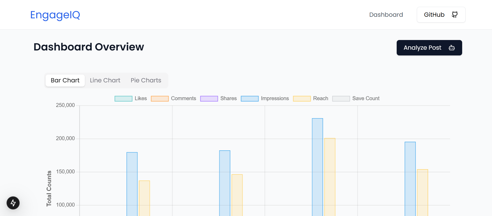

# EngageIQ

EngageIQ is an intelligent social media analytics platform that combines the power of **DataStax Astra DB** and advanced **AI** to help you understand and optimize your social media performance. Our platform processes your engagement data , providing actionable insights that drive results.

---

# Team Details
Team Name: Team Unique

<table>
<tr>
<td width="50%">

### Team Members
- [Dinesh Rathod](https://github.com/codewithdinesh)
- [Abhishek Pawar](https://github.com/abhishek-03113)
- [Mayank Mehta](https://github.com/mayankmehta8)
- [Shravani Shalgar](https://github.com/sshalgar)

</td>
<td width="50%">

### Team Logo


</td>
</tr>
</table>

## Live Preview
Website: https://iq-engage.vercel.app/

Video:  https://www.youtube.com/watch?v=eNLKAJuh2LI   


## Key Features


### Automated Data Analysis
- Automate data analysis to save time and improve efficiency.

### Enhanced Decision-Making
- Enhance decision-making with intuitive visualizations.

### AI-Powered Insights
- Get intelligent recommendations using GPT integration.

### Advanced Visualization
- Beautiful charts and graphs for better understanding.

### Content Strategy Optimization
- Optimize content strategies with actionable, data-driven recommendations.

### Brand Reputation Protection
- Protect brand reputation by identifying trends and issues quickly.

### Real-time Analytics
- Track engagement metrics across different post types instantly.

---


### Key Highlights
- Created a dataset simulating social media engagement, including likes, shares, comments, and post types.
- Stored and managed data in **DataStax Astra DB** for scalable and efficient querying.
- Built workflows using **Langflow** to analyze post performance and calculate average engagement metrics.
- Integrated GPT to generate meaningful insights, such as comparing engagement levels across different post formats.
- Visualized data with an intuitive dashboard built using **Next.js 14** and **Tailwind CSS**.

---

## Setup and Installation

### Prerequisites
- **Node.js**: Ensure you have Node.js installed (for Next.js).
- **DataStax Astra DB**: Set up an Astra DB instance.
- **Langflow**: Install Langflow and configure GPT integration.

### Steps
1. Clone the repository:
   ```bash
   git clone https://github.com/Abhishek-03113/EngageIQ
   cd app
   ```
2. Install dependencies:
   ```bash
   npm install
   ```
3. Set up environment variables:
   - Add your **Astra DB credentials** and **API keys** to a `.env` file.

4. Start the development server:
   ```bash
   npm run dev
   ```

5. Open the application in your browser at `http://localhost:3000`.

---

## Technologies Used
- **Frontend:** Next.js 14, Shadcn UI, Tailwind CSS
- **Backend:** Node.js, Langflow
- **Database:** DataStax Astra DB
- **AI Integration:** GPT for insights and recommendations

## Screenshots


## Acknowledgments
- **Langflow** for enabling seamless GPT integration.
- **DataStax Astra DB** for powerful database capabilities.
